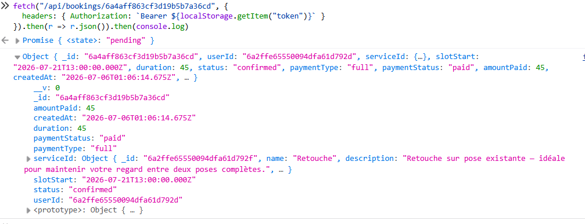
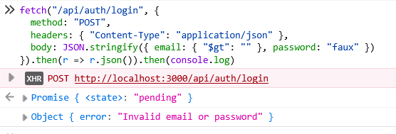
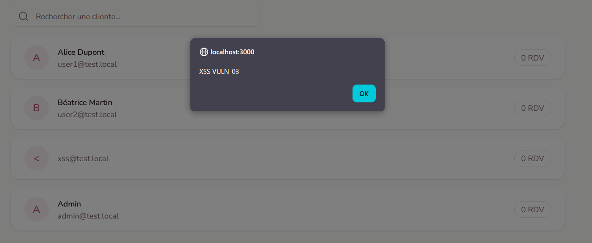
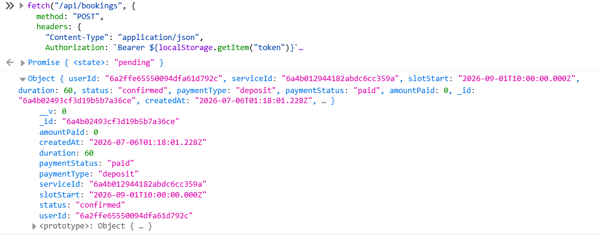
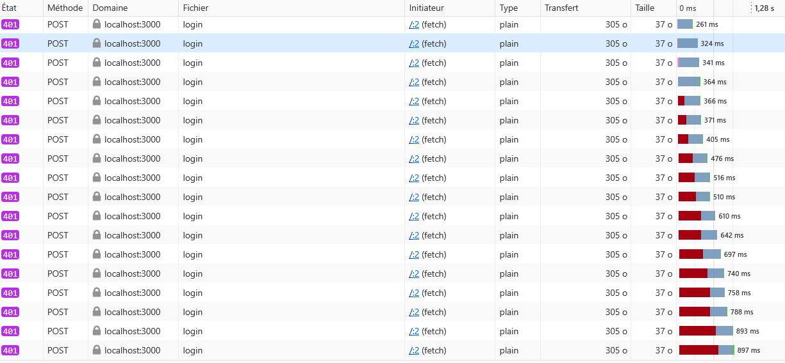
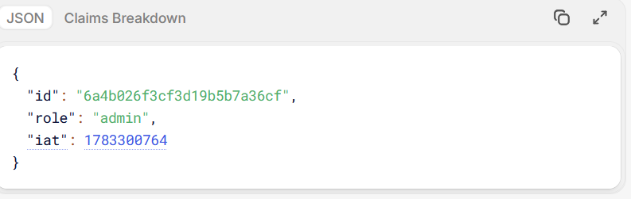
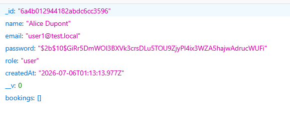
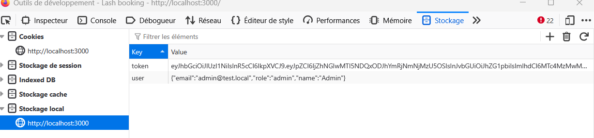

# Rapport d'audit sécurité — Lash Booking

---

## 1. Présentation du projet

**Lash Booking** est une application web de réservation pour un salon de pose d'extensions de cils. Elle permet à des clientes de créer un compte, de réserver une prestation, de choisir un créneau et un mode de paiement (acompte ou paiement complet). Un espace d'administration permet à l'admin de gérer les rendez-vous et les clientes.

L'application a été développée dans le cadre d'un projet de sécurité web avec deux versions distinctes :

- **branche `vulnerable`** : version intentionnellement vulnérable, objet du présent audit
- **branche `secure`** : version corrigée avec pipeline DevSecOps

---

## 2. Architecture de l'application

**Stack technique**

| Couche           | Technologie                                             |
| ---------------- | ------------------------------------------------------- |
| Framework        | Next.js 15 (App Router)                                 |
| Base de données  | MongoDB via Mongoose                                    |
| Authentification | JWT signé avec `jsonwebtoken`, stocké en `localStorage` |
| Frontend         | React, Tailwind CSS, Framer Motion                      |
| Runtime          | Node.js                                                 |

**Modèles de données**

| Modèle         | Champs principaux                                                                                      |
| -------------- | ------------------------------------------------------------------------------------------------------ |
| `User`         | `name`, `email`, `password` (bcrypt), `role` (user/admin)                                              |
| `Booking`      | `userId`, `serviceId`, `slotStart`, `duration`, `status`, `paymentType`, `paymentStatus`, `amountPaid` |
| `Service`      | `name`, `description`, `duration`, `price`, `depositAmount`                                            |
| `WorkingHours` | `dayOfWeek`, `startTime`, `endTime`, `isActive`                                                        |

**Routes API**

| Méthode          | Endpoint                  | Rôle                                      |
| ---------------- | ------------------------- | ----------------------------------------- |
| POST             | `/api/auth/register`      | Inscription                               |
| POST             | `/api/auth/login`         | Connexion, retourne un JWT                |
| GET              | `/api/services`           | Liste des prestations                     |
| GET/POST         | `/api/bookings`           | Liste / création de réservation           |
| GET/PATCH/DELETE | `/api/bookings/[id]`      | Consultation / modification / suppression |
| GET              | `/api/availability`       | Créneaux disponibles                      |
| GET              | `/api/admin/bookings`     | Toutes les réservations (admin)           |
| GET              | `/api/admin/clients`      | Liste des clientes (admin)                |
| GET              | `/api/admin/clients/[id]` | Détail d'une cliente (admin)              |

**Pages**

| Route        | Accès                                    |
| ------------ | ---------------------------------------- |
| `/`          | Page d'accueil publique                  |
| `/register`  | Inscription                              |
| `/login`     | Connexion                                |
| `/booking`   | Tunnel de réservation (authentifié)      |
| `/dashboard` | Espace cliente (authentifié)             |
| `/admin`     | Administration (authentifié, rôle admin) |

---

## 3. Installation et lancement

### Prérequis

- Node.js ≥ 18
- MongoDB en local (port 27017)

### Installation

```bash
git clone <repo>
cd lash-booking
git checkout vulnerable
npm install
```

### Variables d'environnement

Créer un fichier `.env.local` à la racine :

```
MONGODB_URI=mongodb://localhost:27017/lash-booking
JWT_SECRET=unsecret
```

### Seed (données de test)

```bash
node scripts/seed.mjs
```

### Lancement

```bash
npm run dev
```

L'application est accessible sur `http://localhost:3000`.

### Comptes de test

| Rôle                  | Email              | Mot de passe  |
| --------------------- | ------------------ | ------------- |
| Cliente               | `user1@test.local` | `password123` |
| Cliente               | `user2@test.local` | `password123` |
| Cliente (payload XSS) | `xss@test.local`   | `password123` |
| Admin                 | `admin@test.local` | `admin123`    |

---

## 4. Organisation Git

```
lash-booking/
├── src/
│   ├── app/               # Pages et routes API (Next.js App Router)
│   ├── components/        # Composants React
│   ├── contexts/          # Contextes React
│   ├── lib/               # Utilitaires (jwt, mongodb, booking...)
│   └── models/            # Modèles Mongoose
├── scripts/
│   └── seed.mjs           # Script de données de test
├── screenshots/           # Captures des exploitations
├── SECURITY_AUDIT.md      # Ce rapport
└── README.md
```

**Branches**

- `vulnerable` — version avec failles intentionnelles (branche courante)
- `secure` — version corrigée avec pipeline CI/CD

---

## 5. Liste des vulnérabilités intégrées

| ID       | Nom                                                        | Type OWASP                                 | Criticité |
| -------- | ---------------------------------------------------------- | ------------------------------------------ | --------- |
| VULN-01  | IDOR sur les réservations                                  | Broken Access Control — A01:2021           | Élevée    |
| VULN-02  | NoSQL Injection sur le login                               | Injection — A03:2021                       | Moyenne   |
| VULN-03  | XSS stocké sur le nom de la cliente                        | XSS — A03:2021                             | Élevée    |
| VULN-04a | Mass Assignment sur les réservations                       | Security Misconfig — A05:2021              | Élevée    |
| VULN-04b | Mass Assignment via register (élévation de privilège)      | Broken Access Control — A01:2021           | Critique  |
| VULN-05  | Authentification faible (JWT sans expiration, brute force) | Broken Auth — A07:2021                     | Élevée    |
| VULN-06  | Information Disclosure (hash mot de passe exposé)          | Security Misconfig — A05:2021              | Élevée    |
| VULN-07  | JWT stocké en localStorage                                 | Auth faible / amplificateur XSS — A07:2021 | Moyenne   |

---

## 6. Audit détaillé des vulnérabilités

---

### VULN-01 — IDOR sur les réservations

**Type**
Broken Access Control / IDOR / BOLA — A01:2021

**Endpoint concerné**
`GET /api/bookings/[id]`, `DELETE /api/bookings/[id]`, `PATCH /api/bookings/[id]`

**Fichier**
`src/app/api/bookings/[id]/route.js`

**Description**
L'endpoint récupère, modifie ou supprime une réservation uniquement par son identifiant MongoDB, sans vérifier que la réservation appartient à l'utilisateur connecté. N'importe quel utilisateur authentifié peut accéder aux réservations d'un autre utilisateur en changeant l'identifiant dans l'URL.

**Cause technique**

```javascript
// Version vulnérable — aucun contrôle d'ownership
const booking = await Booking.findById(id).populate("serviceId");
```

**Exploitation**

1. Se connecter avec `user1@test.local`
2. Récupérer l'identifiant d'une réservation appartenant à `user2` (via le dashboard ou en devinant l'id)
3. Envoyer la requête suivante avec le token de `user1` :

```http
GET /api/bookings/<id_de_user2> HTTP/1.1
Authorization: Bearer <token_user1>
```

**Preuve**



La réponse retourne les données de la réservation de `user2` alors que la requête est authentifiée avec le token de `user1`.

**Impact**

- Lecture, modification et suppression des réservations d'autres utilisateurs
- Fuite de données personnelles (service, créneau, montant payé)
- Sabotage du planning d'autres clientes

**Criticité :** Élevée

**Correction appliquée (branche `secure`)**

```javascript
const booking = await Booking.findOne({ _id: id, userId: user.id });
```

**Validation après correction**
La même requête retourne `404 Not Found`. `user1` ne peut plus accéder aux réservations de `user2`.

---

### VULN-02 — NoSQL Injection sur le login

**Type**
Injection (NoSQLi) — A03:2021

**Endpoint concerné**
`POST /api/auth/login`

**Fichier**
`src/app/api/auth/login/route.js`

**Description**
Le corps de la requête est passé directement à `User.findOne()` sans validation de type. Un attaquant peut injecter des opérateurs MongoDB (`$gt`, `$regex`, `$ne`) pour manipuler la requête et énumérer les comptes existants.

**Cause technique**

```javascript
// Version vulnérable — pas de validation de type sur email
const { email, password } = await req.json();
const user = await User.findOne({ email });
```

Si `email` est un objet (`{ "$gt": "" }`), Mongoose le passe tel quel à MongoDB qui l'interprète comme un opérateur de comparaison.

**Exploitation**

Payload envoyé via le formulaire de login (ou Burp) :

```json
{
  "email": { "$gt": "" },
  "password": "nimportequoi"
}
```

`findOne({ email: { "$gt": "" } })` retourne le premier utilisateur de la collection. La vérification `bcrypt.compare` échoue si le mot de passe ne correspond pas, mais la réponse `"Invalid email or password"` confirme qu'un compte existe — permettant l'énumération.

**Preuve**



**Impact**

- Énumération de comptes existants
- Manipulation des requêtes MongoDB
- Risque de bypass d'authentification partiel

**Criticité :** Moyenne

**Correction appliquée (branche `secure`)**

```javascript
// Validation stricte avec Zod — rejette tout type non-string
const schema = z.object({
  email: z.string().email(),
  password: z.string().min(1),
});
const { email, password } = schema.parse(await req.json());
```

**Validation après correction**
Le payload objet retourne `400 Bad Request` avant toute interaction avec MongoDB.

---

### VULN-03 — XSS stocké sur le nom de la cliente

**Type**
Stored XSS — A03:2021

**Zone concernée**
`src/components/admin/ClientList.jsx` — dashboard admin, onglet Clientes

**Description**
Le champ `name` saisi lors de l'inscription est stocké en base sans sanitization. Dans le dashboard admin, ce champ est rendu avec `dangerouslySetInnerHTML`, ce qui désactive l'échappement automatique de React et permet l'exécution de code JavaScript arbitraire.

**Cause technique**

```jsx
// Version vulnérable — dangerouslySetInnerHTML sur une donnée utilisateur
<p
  className="font-semibold"
  dangerouslySetInnerHTML={{ __html: client.name }}
/>
```

**Exploitation**

1. S'inscrire via `/register` avec le nom suivant :

```

```

2. Se connecter en admin sur `admin@test.local`
3. Ouvrir l'onglet **Clientes** dans `/admin`

Le payload s'exécute immédiatement au chargement de la liste.

**Preuve**



La boîte de dialogue `alert` apparaît avec le contenu de `document.cookie` dès l'ouverture de l'onglet Clientes. Le compte `xss@test.local` (seedé) permet de reproduire la démo sans inscription manuelle.

**Impact**

- Exécution de code JavaScript arbitraire dans le contexte de la session admin
- Vol du token JWT stocké en `localStorage` (combiné à VULN-07)
- Défacement de l'interface
- Actions effectuées au nom de l'administrateur

**Criticité :** Élevée

**Correction appliquée (branche `secure`)**

```jsx
// Suppression de dangerouslySetInnerHTML — React échappe automatiquement
<p className="font-semibold">{client.name}</p>
```

Ajout d'une Content Security Policy dans `next.config.js` pour limiter l'exécution de scripts non autorisés.

**Validation après correction**
Le payload s'affiche comme texte brut (``). Aucune alerte ne s'exécute.

---

### VULN-04a — Mass Assignment sur les réservations

**Type**
Mass Assignment / Security Misconfiguration — A05:2021

**Endpoint concerné**
`POST /api/bookings`, `PATCH /api/bookings/[id]`

**Fichier**
`src/app/api/bookings/route.js`, `src/app/api/bookings/[id]/route.js`

**Description**
Le corps de la requête est spreadé directement dans `Booking.create()` et `Booking.findByIdAndUpdate()` sans whitelist de champs. Un client peut forcer des champs sensibles comme `status`, `paymentStatus` ou `amountPaid` pour créer une réservation confirmée et marquée comme payée sans paiement réel.

**Cause technique**

```javascript
// Version vulnérable — le spread du body écrase les valeurs calculées
const booking = await Booking.create({
  amountPaid: defaultAmountPaid,
  paymentStatus: defaultPaymentStatus,
  status,
  ...body, // body peut contenir status, paymentStatus, amountPaid
  userId: user.id,
});
```

**Exploitation**

```http
POST /api/bookings HTTP/1.1
Authorization: Bearer <token_user>
Content-Type: application/json

{
  "serviceId": "<id>",
  "slotStart": "2026-08-01T10:00:00.000Z",
  "duration": 60,
  "paymentType": "deposit",
  "status": "confirmed",
  "paymentStatus": "paid",
  "amountPaid": 0
}
```

**Preuve**



La réponse 201 retourne `status: "confirmed"` et `paymentStatus: "paid"` avec `amountPaid: 0` — réservation confirmée sans paiement.

**Impact**

- Réservations auto-confirmées sans intervention de l'admin
- Marquage d'une réservation comme payée sans paiement réel
- Perte financière pour le salon

**Criticité :** Élevée

**Correction appliquée (branche `secure`)**

```javascript
// Whitelist explicite des champs acceptés
const { serviceId, slotStart, duration, paymentType } = await req.json();
const booking = await Booking.create({
  serviceId,
  slotStart,
  duration,
  paymentType,
  amountPaid: defaultAmountPaid,
  paymentStatus: defaultPaymentStatus,
  status: "pending",
  userId: user.id,
});
```

---

### VULN-04b — Mass Assignment via register (élévation de privilège)

**Type**
Broken Access Control / Mass Assignment — A01:2021

**Endpoint concerné**
`POST /api/auth/register`

**Fichier**
`src/app/api/auth/register/route.js`

**Description**
Le champ `role` est extrait directement du corps de la requête et passé à `User.create()` sans validation. N'importe qui peut créer un compte administrateur en ajoutant `"role": "admin"` dans le corps de la requête d'inscription.

**Cause technique**

```javascript
// Version vulnérable — role lu depuis le body sans vérification
const { name, email, password, role } = await req.json();
const user = await User.create({ name, email, password: hashedPassword, role });
```

**Exploitation**

Via le formulaire `/register` ou directement :

```http
POST /api/auth/register HTTP/1.1
Content-Type: application/json

{
  "name": "Attaquant",
  "email": "attaquant@evil.com",
  "password": "password123",
  "role": "admin"
}
```

Après login, le JWT contient `role: "admin"`. L'accès à `/admin` et toutes les routes admin est accordé.

**Preuve**


Le JWT décodé sur [jwt.io](https://jwt.io) montre `"role": "admin"` pour le compte créé.

**Impact**

- Élévation de privilège totale sans aucune barrière
- Accès complet à l'administration (réservations, clientes)
- Prise de contrôle de l'application

**Criticité :** Critique

**Correction appliquée (branche `secure`)**

```javascript
// Le role n'est jamais lu depuis le body — toujours "user" par défaut
const { name, email, password } = await req.json();
const user = await User.create({
  name,
  email,
  password: hashedPassword,
  role: "user",
});
```

**Validation après correction**
La même requête avec `"role": "admin"` crée un compte avec `role: "user"`. L'accès à `/admin` est refusé.

---

### VULN-05 — Authentification faible

**Type**
Broken Authentication — A07:2021

**Zone concernée**
`src/lib/jwt.js` (signToken), `POST /api/auth/login`

**Description**
Deux faiblesses cumulées : le JWT est signé sans durée d'expiration (token valide indéfiniment) et aucun mécanisme de rate limiting n'est en place sur l'endpoint de login, rendant le brute force trivial.

**Cause technique**

```javascript
// Version vulnérable — pas d'expiresIn → token éternel
export function signToken(payload) {
  return jwt.sign(payload, secret);
}
```

Pas de `middleware.js` ni de compteur de tentatives sur `/api/auth/login`.

**Exploitation**

**Token éternel** : décoder le JWT sur `jwt.io` → le payload ne contient pas de claim `exp`. Un token volé (via XSS, réseau non chiffré, fuite de logs) reste utilisable indéfiniment.

**Brute force** : envoyer en boucle des requêtes sans être bloqué :

```bash
for i in $(seq 1 100); do
  curl -s -X POST http://localhost:3000/api/auth/login \
    -H "Content-Type: application/json" \
    -d '{"email":"user1@test.local","password":"tentative'$i'"}'
done
```

Aucun `429 Too Many Requests` n'est retourné.

**Preuves**




JWT décodé sans claim `exp` + 100 requêtes de login sans blocage.

**Impact**

- Session compromise permanente si le token est volé
- Brute force de mots de passe sans limite de tentatives

**Criticité :** Élevée

**Correction appliquée (branche `secure`)**

```javascript
// Expiration à 1 heure
export function signToken(payload) {
  return jwt.sign(payload, secret, { expiresIn: "1h" });
}
```

Ajout d'un rate limiting dans `middleware.js` : 5 tentatives par IP toutes les 15 minutes, réponse `429` au-delà.

**Validation après correction**
JWT décodé contient un claim `exp`. Après 5 tentatives échouées, les requêtes suivantes reçoivent `429 Too Many Requests`.

---

### VULN-06 — Information Disclosure (hash mot de passe exposé)

**Type**
Security Misconfiguration / Information Disclosure — A05:2021

**Endpoint concerné**
`GET /api/admin/clients/[id]`

**Fichier**
`src/app/api/admin/clients/[id]/route.js`

**Description**
L'endpoint retourne l'objet `User` complet depuis MongoDB, incluant le champ `password` (hash bcrypt), sans avoir appelé `.select("-password")`. La donnée est visible dans l'onglet Réseau des DevTools du navigateur même si le frontend ne l'affiche pas. De plus, l'absence de `try/catch` expose la stack trace Mongoose en cas d'identifiant malformé.

**Cause technique**

```javascript
// Version vulnérable — User.findById sans exclure le champ password
const client = await User.findById(id);
return NextResponse.json({ ...client.toObject(), bookings }, { status: 200 });
```

**Exploitation**

1. Se connecter en admin (ou en simple user — aucun contrôle de rôle sur la route)
2. Ouvrir `/admin` → onglet Clientes → cliquer sur "Voir" pour une cliente
3. Ouvrir DevTools → onglet **Réseau** → sélectionner la requête `GET /api/admin/clients/<id>`
4. Dans l'onglet **Réponse**, le champ `password` est visible :

```json
{
  "_id": "...",
  "name": "Alice Dupont",
  "email": "user1@test.local",
  "password": "$2b$10$...",
  "role": "user",
  ...
}
```

Pour la stack trace : appeler `GET /api/admin/clients/invalid-id` — Mongoose lève une `CastError` non gérée.

**Preuve**



**Impact**

- Fuite du hash bcrypt → crackable offline (hashcat, john) si mot de passe faible
- Fuite de la structure interne de la base de données
- Risque RGPD : exposition de données personnelles

**Criticité :** Élevée

**Correction appliquée (branche `secure`)**

```javascript
// Exclusion explicite du champ password
const client = await User.findById(id).select("-password");
```

Ajout d'un `try/catch` avec réponse générique en cas d'erreur :

```javascript
try {
  const client = await User.findById(id).select("-password");
} catch {
  return NextResponse.json(
    { error: "Une erreur est survenue" },
    { status: 500 },
  );
}
```

**Validation après correction**
La réponse JSON ne contient plus le champ `password`. Une requête avec un id malformé retourne `500` sans stack trace.

---

### VULN-07 — JWT stocké en localStorage

**Type**
Broken Authentication / Amplificateur XSS — A07:2021

**Zone concernée**
`src/components/auth/LoginForm.jsx`, `src/components/booking/StepSlot.jsx`, `src/components/booking/BookingTunnel.jsx`

**Description**
Le token JWT est stocké en `localStorage` plutôt qu'en cookie `httpOnly`. Il est donc accessible depuis JavaScript, ce qui le rend volable via un XSS (VULN-03).

**Cause technique**

```javascript
// LoginForm.jsx — token stocké en localStorage après login
localStorage.setItem("token", data.token);

// Partout dans l'app — token lu depuis localStorage
const token = localStorage.getItem("token");
```

**Exploitation**

En combinaison avec VULN-03, le payload XSS suivant exfiltre le token :

```html

```

Le token reçu côté attaquant permet d'usurper la session de la victime.

**Impact**

- Vol de session via XSS
- Seul : risque modéré (XSS requis) / Combiné à VULN-03 : risque élevé

**Criticité :** Moyenne seule — Élevée combinée à VULN-03

**Preuve**



**Correction appliquée (branche `secure`)**

Le token est transmis via un cookie `httpOnly; Secure; SameSite=Strict` :

```javascript
response.cookies.set("token", token, {
  httpOnly: true,
  secure: process.env.NODE_ENV === "production",
  sameSite: "strict",
  maxAge: 3600,
});
```

Suppression de tous les appels `localStorage.getItem/setItem("token")`.

**Validation après correction**
`localStorage.getItem("token")` retourne `null`. Le token n'est plus accessible depuis JavaScript.

---

## 7. Pipeline sécurité

> La pipeline est implémentée sur la branche `secure`. Se référer à `.github/workflows/security.yml` sur cette branche.

**Outils intégrés**

| Contrôle          | Outil              | Objectif                        |
| ----------------- | ------------------ | ------------------------------- |
| SAST              | Semgrep            | Analyse statique du code source |
| SCA               | `npm audit`        | Audit des dépendances           |
| Secret scanning   | Gitleaks           | Détection de secrets exposés    |
| DAST              | OWASP ZAP baseline | Test dynamique de l'application |
| Tests applicatifs | `npm test`         | Vérification du fonctionnement  |

La pipeline s'exécute automatiquement sur `push` et `pull_request`. Elle échoue en cas de faille critique ou de secret détecté.

---

## 8. Résultats des scans

> À compléter après exécution de la pipeline sur la branche `secure`.

| Outil     | Résultat |
| --------- | -------- |
| Semgrep   | —        |
| npm audit | —        |
| Gitleaks  | —        |
| OWASP ZAP | —        |

---

## 9. Limites du projet

- Le brute force (VULN-05) est démontré localement sans script automatisé — la preuve se fait via des requêtes manuelles répétées sans réponse 429.
- VULN-02 (NoSQL Injection) permet l'énumération mais pas le bypass total d'authentification car la vérification bcrypt reste côté Node.js et non dans la requête Mongo.
- Les corrections de la branche `secure` ne couvrent pas la mise en place d'un système de paiement réel — `amountPaid` reste un champ déclaratif.
- Pas de CORS volontairement permissif implémenté : Next.js applique une politique par défaut restrictive.

---

## 10. Conclusion

Ce projet démontre un cycle complet de sécurité applicative sur une application de réservation réaliste. Les six catégories obligatoires sont couvertes : IDOR, injection, XSS, authentification faible, mass assignment et information disclosure.

La faille la plus critique est **VULN-04b** (élévation de privilège via register) : une ligne de code (`role` lu depuis le body) suffit à compromettre totalement le système de rôles. La chaîne **VULN-03 + VULN-07** (XSS stocké + JWT en localStorage) illustre comment des vulnérabilités de criticité individuelle modérée peuvent se combiner pour produire un impact critique.

La branche `secure` corrige toutes les failles documentées avec des corrections ciblant la cause profonde, et non des contournements superficiels.
